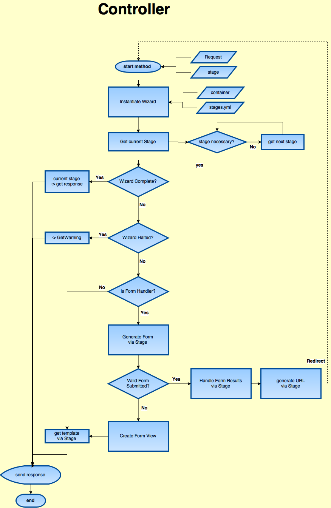

# Wizard

The Wizard Component is a management tool for multi-stage user interaction. It utilizes several Interfaces and the
Wizard class to create a workflow that is compatible with Symfony Forms and Twig templating. Relying on the concept of
**Stages**, the developer is able to define a sequence using a `.yml` file and control that sequence in their Controller.

On instantiation, the Wizard class requires a **StageContainer** and a full path to the **stage definition file**
(in yaml format). The Wizard will load the stage definitions from there. The Wizard Component includes a YamlFileLoader
for this purpose.

Create a concrete class that extends the `Zikula\Component\Wizard\AbstractStageContainer`. Use autowiring and autoconfiguration
to configure the class:

```yaml
_instanceof: # only works for classes that are configured in this file
    Zikula\Component\Wizard\StageInterface:
        tags: ['my_special_tag']

# if this is the only instance of the interface you will use, you can use an alias
Zikula\Component\Wizard\StageContainerInterface: '@Acme\Bundle\MyCustomBundle\Container\FooStageContainer'

Acme\Bundle\MyCustomBundle\Container\FooStageContainer:
    arguments:
        $stages: !tagged_iterator my_special_tag
```

## Stage

A Stage is simply a class which implements the StageInterface. It defines a **name**, a **template name** and any
**template parameters** that stage will require. A stage must also define whether it is **necessary** by possibly
completing some logic and returning a boolean. Stages marked as NOT **necessary** will be skipped following their
instantiation and processing of the `isNecessary()` method, allowing that stage to complete tasks as needed before
proceeding. Stages are skipped when the Wizard calls the `getCurrentStage()` method.

Use Symfony autowiring and autoconfiguring or manual Dependency Injection to add services to your stages.

Stages may optionally implement:
 - `InjectContainerInterface` if the Stage requires the Symfony container
 - `FormHandlerInterface` if the Stage will be using a Symfony Form

The Wizard can be halted in the `isNecessary()` method by throwing an `AbortStageException`. The message of which is
available for retrieval using `$wizard->getWarning()`.


## Stage Definition File

The stage definition file is a simple yaml file. The first key `stages:` is required and then each stage should be
listed by `name` and each should have properties `class` and `order`. The `name` key must be the same as the name of the
stage as set in its Stage class. The `class` property should be the fully-qualified classname (with namespace) and the
`order` property should be an integer identifying the sequential order of the stage. Optionally, a stage can be
identified with a `default` property which should be set to true. This stage will be used by the wizard if no stage
argument is provided.


### Sample stages.yml

```yaml
stages:
    prep:
        class: Acme\Bundle\DemoBundle\Stage\PrepStage
        order: 1
        default: true
    getinfo:
        class: Acme\Bundle\DemoBundle\Stage\GetInfoStage
        order: 2
    noform:
        class: Acme\Bundle\DemoBundle\Stage\NoFormStage
        order: 3
    complete:
        class: Acme\Bundle\DemoBundle\Stage\CompleteStage
        order: 4
    nonstage:
        class: Acme\Bundle\DemoBundle\Stage\NonStage
        order: 99
```


### Sample Controller

```php
use Symfony\Component\Form\FormFactoryInterface;
use Symfony\Component\HttpFoundation\Response;
use Symfony\Component\HttpFoundation\RedirectResponse;
use Symfony\Component\HttpFoundation\Request;
use Symfony\Component\Routing\RouterInterface;
use Zikula\Component\Wizard\FormHandlerInterface;
use Zikula\Component\Wizard\StageContainerInterface;
use Zikula\Component\Wizard\Wizard;
use Zikula\Component\Wizard\WizardCompleteInterface;

class MyController
{
    /**
     * @var StageContainerInterface
     */
    private $stageContainer;

    /**
     * @var \Twig\Environment
     */
    private $twig;

    /**
     * @var FormFactoryInterface
     */
    private $formFactory;

    /**
     * @var RouterInterface
     */
    private $router;

    /**
     * define route = 'index/{stage}'
     */
    public function indexAction(Request $request, $stage)
    {
        // begin the wizard
        $wizard = new Wizard($this->stageContainer, realpath(__DIR__ . '/../Resources/config/stages.yml'));
        $currentStage = $wizard->getCurrentStage($stage);
        if ($currentStage instanceof WizardCompleteInterface) {
            return $currentStage->getResponse($request);
        }
        $templateParams = $currentStage->getTemplateParams();
        if ($wizard->isHalted()) {
            $request->getSession()->getFlashBag()->add('danger', $wizard->getWarning());
            return new Response($this->twig->render('@MyCustomBundle/error.html.twig', $templateParams));
        }

        // handle the form
        if ($currentStage instanceof FormHandlerInterface) {
            $form = $this->formFactory->create($currentStage->getFormType());
            $form->handleRequest($request);
            if ($form->isSubmitted() && $form->isValid()) {
                $currentStage->handleFormResult($form);
                $url = $this->router->generate('index', ['stage' => $wizard->getNextStage()->getName()], true);

                return new RedirectResponse($url);
            }
            $templateParams['form'] = $form->createView();
        }

        return new Response($this->twig->render($currentStage->getTemplateName(), $templateParams));
    }
}
```


